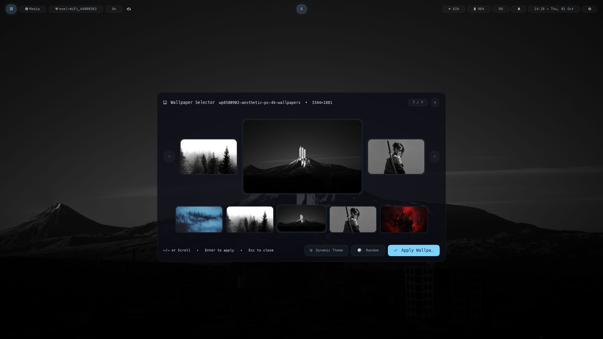

# wyrd-wallpaper

> **Status (`v0.1.0`)**: Early public release. State file schemas and CLI flags may evolve before `1.0`.



A Wayland wallpaper daemon with Material You dynamic palette extraction. Renders wallpapers across multiple monitors via `wlr-layer-shell`, extracts a Material You dark color scheme from the image, and writes canonical state files (`wallpaper.toml` and `theme.toml`) via `wyrd_engine::state_files` so [`wyrd-shell`](https://github.com/xximxxhatedxx/wyrd-shell) and [`wyrd-greet`](https://github.com/xximxxhatedxx/wyrd-greet) synchronize their themes automatically.

---

## Features

- **Multi-monitor wallpaper**: Each output is controlled independently via `wlr-layer-shell` (`Layer::Background`) with radial crossfade transitions.
- **Material You palette extraction**: Generates `accent`, `background`, `surface`, `surface_container`, `on_surface`, and related tokens from the dominant colors in your wallpaper image. Supports manual accent override (`wyrd-wallpaper color manual --accent "#7dd3fc"`).
- **Interactive wallpaper picker**: Thumbnail carousel and filmstrip UI with 60 fps scroll physics, hover elevation, and smooth open/close animations (`wyrd-wallpaper select`).
- **Image format support**: PNG, JPEG, WebP, AVIF, BMP.
- **Systemd user service**: `install.sh` sets up autostart with `graphical-session.target`.

---

## System Dependencies

- **Arch Linux**: `sudo pacman -S --needed rust cargo wayland libxkbcommon fontconfig`
- **Debian / Ubuntu**: `sudo apt install cargo pkg-config libwayland-dev libxkbcommon-dev libfontconfig1-dev`
- **Fedora**: `sudo dnf install rust cargo pkgconf-pkg-config wayland-devel libxkbcommon-devel fontconfig-devel`

---

## Installation

```bash
git clone https://github.com/xximxxhatedxx/wyrd-wallpaper.git
cd wyrd-wallpaper
./install.sh
```

Options supported by `./install.sh`:
- `--bin-dir <DIR>` - Destination directory for binary (default: `~/.local/bin`)
- `-b, --build` - Force rebuild from source (`cargo build --release --locked`)
- `--no-systemd` - Skip installing/enabling the systemd user service
- `--dry-run` - Preview actions without modifying files
- `--uninstall` - Remove binary and systemd service (or run `./uninstall.sh`)

---

## Usage

```bash
# Start the daemon
wyrd-wallpaper run

# Start and set an initial image
wyrd-wallpaper run --image ~/Pictures/Wallpapers/mountain.jpg

# Target a specific output
wyrd-wallpaper run --output DP-1 --image ~/Pictures/Wallpapers/forest.png

# Set wallpaper on a running daemon
wyrd-wallpaper set ~/Pictures/Wallpapers/sunset.jpg

# List all images found in ~/Pictures/Wallpapers
wyrd-wallpaper list

# Show the active wallpaper path and generated palette
wyrd-wallpaper current

# Open the interactive picker
wyrd-wallpaper select

# Palette control
wyrd-wallpaper color auto
wyrd-wallpaper color manual --accent "#7dd3fc"
```

---

## Autostart

**Niri** (`~/.config/niri/config.kdl`):
```kdl
spawn-at-startup "wyrd-wallpaper" "run"
```

**Hyprland** (`~/.config/hypr/hyprland.conf`):
```ini
exec-once = wyrd-wallpaper run
```

**Sway** (`~/.config/sway/config`):
```ini
exec wyrd-wallpaper run
```

**systemd** (configured automatically by `install.sh`):
```bash
systemctl --user enable --now wyrd-wallpaper.service
```

---

## State Files Schema (`wallpaper.toml` & `theme.toml`)

`wyrd-wallpaper` writes its state via `wyrd_engine::state_files` to:
- `$XDG_RUNTIME_DIR/wyrd/wallpaper.toml` and `$XDG_RUNTIME_DIR/wyrd/theme.toml` (live IPC state)
- `$XDG_STATE_HOME/wyrd/wallpaper.toml` (`~/.local/state/wyrd/wallpaper.toml`, persistent across reboots)
- `$XDG_CONFIG_HOME/wyrd/wallpaper.toml` (`~/.config/wyrd/wallpaper.toml`, Lua theme loader state)

When no valid primary output is stored, `primary` is selected as the lexicographically first output identifier. This is a deterministic fallback, not a compositor-designated or user-selected primary monitor.

### `wallpaper.toml`

```toml
color_mode = "auto"
accent = "#7dd3fc"
auto_accent = "#7dd3fc"
primary = "DP-1"

[outputs]
eDP-1 = "/home/user/Pictures/Wallpapers/mountain.jpg"
DP-1 = "/home/user/Pictures/Wallpapers/mountain.jpg"

[palette]
primary = "#7dd3fc"
surface = "#0f1419"
surface_container = "#1b2026"
on_surface = "#e1e2e8"
outline = "#8b9198"
```

### `theme.toml`

```toml
accent = "#7dd3fc"
background = "#0f1419"
foreground = "#e1e2e8"
radius = 8.0
```

---

## Related

- [`wyrd-engine`](https://github.com/xximxxhatedxx/wyrd-engine) - Rendering and scripting engine
- [`wyrd-shell`](https://github.com/xximxxhatedxx/wyrd-shell) - Desktop shell that picks up the generated palette
- [`wyrd-greet`](https://github.com/xximxxhatedxx/wyrd-greet) - Display manager greeter and session locker that reads the wallpaper and palette

---

## Support

If you find it useful, you can support the project here.

[](https://ko-fi.com/xximxxhatedxx)

---

## License

Dual-licensed under [MIT](LICENSE-MIT) or [Apache-2.0](LICENSE-APACHE).
